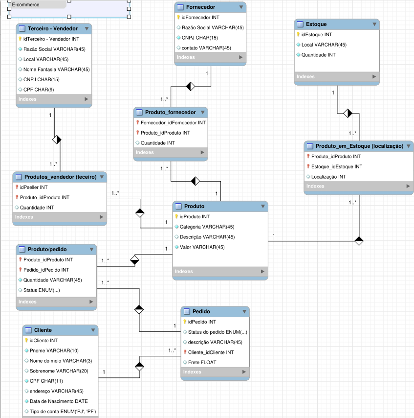

# 💵 Ecommerce DIO 💵

# 

Opções de menu no Sistema Bancário

>"Faça o teu melhor, na condição que você tem, enquanto você não tem condições melhores, para fazer melhor ainda!"
<!-- Mario Sergio Cortella  --> 

# Proposta

Mapear um ER e, a partir deste, gerar o esquema SQL para a criação do BD. Realizar a inserção de valores e recuperar essas informações com queries DML pensadas para responder "perguntas".

1. Mapeamento do esquema ER para Relacional
2. Definição do script SQL para criação do esquema de banco de dados
3. Persistência de dados para testes
4. Recuperação de informações com queries SQL

## Diagrama EER

A imagem mostra um diagrama EER de um banco de dados que envolve as seguintes entidades: produtos, fornecedores, clientes, pedidos, pagamentos e vendedores. Cada entidade tem seus atributos listados abaixo do nome da entidade. Por exemplo, a entidade produtos tem os atributos *IdProduct*, *Pname*, *Classification_kids*, *Category*, *Size* e *Price*.

Os relacionamentos entre as entidades são representados por linhas que ligam as entidades. Cada relacionamento tem uma cardinalidade que indica quantas instâncias de cada entidade estão envolvidas no relacionamento. Por exemplo, o relacionamento entre a entidade *product* e a entidade *productOrder* e tem a cardinalidade 1:N, o que significa que um produto pode estar em vários pedidos, mas cada pedido só contem uma vez determidado produto.

Vale ressaltar que esse diagrama teve seus relacionamentos N:M expandidos em novas entidades para representar como as tabelas estarão no Banco de Dados, afim de aumentar a fidelidade ao Esquema SQL.

Potência Tech powered by iFood | Ciência de Dados- [acesse o curso](https://web.dio.me/track/potencia-tech-powered-ifood-ciencias-de-dados-com-python).

